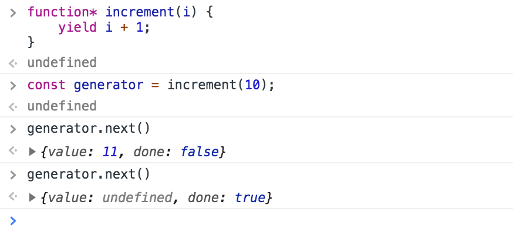

# Today I Learned

####Javascript's Generators
######*July 8th, 2018*

So my reaction when I first saw something like this:

```javascript
function* pleaseSurrender() {
   yield "Never!";
}
```

*Wait, an asterisk in a function definition? Javascript doesn't have C-style pointers, right? Because that's the only place I've ever seen something like that before.*

But nope. The asterisk is used to define generator functions. Two things that leapt out to me about them right off the bat:
* Calling the function returns a sort of iterator that iterates through the yield statements.
* The context is saved as you go through.

An example to make things a little more clear:
```javascript
function* doctorSeuss() {
   var poem = [1, 2, "red", "blue"];
   yield poem.shift();
   yield poem.shift();
   yield poem.shift();
   yield poem.shift();
}

const poet = doctorSeuss();
console.log(poet.next().value + " fish"); // 1 fish
console.log(poet.next().value + " fish"); // 2 fish
console.log(poet.next().value + " fish"); // red fish
console.log(poet.next().value + " fish"); // blue fish
```

Every call of `poet.next()` executes the body of the `doctorSeuss` function until the next yield expression. The `shift()` call returns the first element and pops it from the array. As you can see, the poem array is being modified, and its value persists as we iterate through the generator. 

I'm also calling `poet.next().value` instead of `poet.next()`.  Why?



As you can see, calling the `next()` method on a generator returns an object with two fields: `value` and `done`. The `value` field contains the result of the yield expression, while the `done` field shows whether or not there are yield statements to iterate to. At the first call of `generator.next()`, there was a yield expression to iterate to, so it is not "done" and it does have a value. After a second call, there are not more yield expressions to iterate to, so it is "done", and its return object's value field is set to undefined.


#### Resources for future reference

* [More examples](https://developer.mozilla.org/en-US/docs/Web/JavaScript/Reference/Statements/function*)
* [More about applications for async](https://medium.com/javascript-scene/the-hidden-power-of-es6-generators-observable-async-flow-control-cfa4c7f31435)

