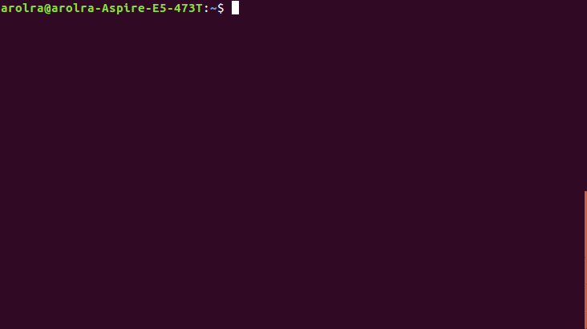

# Today I Learned

####Morning Cup of Cron
######*July 13th, 2018*

*Note: I set this up on MacOS.*

I don't drink coffee. Which can be unfortunate, because I can be quite down and unmotivated in the morning. It would be great if I had something to perk me up in the mornings.

Enter this command:



*Shoutout to [ttygif](https://github.com/icholy/ttygif) (what I used to record my terminal and convert it to a gif)*

Pretty wacky. But it definitely perks me up. I want this command to run in the mornings, and after lunch, since those are the times I'm most prone to being unproductive at work. So I'm going to create a cron job to do it.

What is cron? Tell me, [Wikipedia](https://en.wikipedia.org/wiki/Cron):

`The software utility cron is a time-based job scheduler in Unix-like computer operating systems. People who set up and maintain software environments use cron to schedule jobs (commands or shell scripts) to run periodically at fixed times, dates, or intervals.`

Cool. First I'm going to write a wrapper script called CheerUp.sh.

```shell
#!/bin/sh
PATH=/usr/local/bin:/usr/local/sbin:~/bin:/usr/bin:/bin:/usr/sbin:/sbin

echo ''
fortune | cowsay | lolcat
```

This sets up the correct PATH environment variable, and prints a newline before we output the colourful, insightful, talking cow to the terminal (the PATH variable depends on your operating system).
In any case, now I'm ready to set up the cron job.

` $ crontab -e `

My cron tab looks like this:

```
MAILTO=""

0 10,13 * * 1-5  /Users/churanchen/Coding/resources/CheerUp.sh > /dev/ttys003
```

The `MAILTO=""` is necessary, because otherwise the operating system tries to send me emails, which I don't want. The command `/Users/churanchen/Coding/resources/CheerUp.sh > /dev/ttys003` runs my script and directs the output to the terminal.

The cron time syntax works like:

`<Minute> <Hour> <Day_of_the_Month> <Month_of_the_Year> <Day_of_the_Week>`

So my job runs:

```
0 10,13 * * 1-5
<On the hour> <10am, 1pm> <Every day of the month> <Every month> <Mon-Fri>
```

I can check on my cron jobs with this:

` $ crontab -l `

Cool! That's it! Now I can get my daily dose of cronfee in the morning (cronfee, get it? I'll see myself out).

*Endnote: This simple job took a non-trivial chunk of a evening to set up. Mainly because the PATH variable wasn't set up correctly, so I kept getting errors (hence the wrapper script). Don't know how sysadmins do it.*


#### Resources for future reference

* [If I'm too lazy to learn more cron time syntax](https://crontab.guru/)
* [Guide for setting up jobs on MacOS](https://ole.michelsen.dk/blog/schedule-jobs-with-crontab-on-mac-osx.html)
* [More info for cron on Linux](http://www.unixgeeks.org/security/newbie/unix/cron-1.html)


